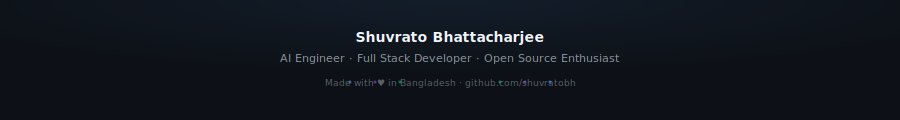

<!-- ============================================================
     SHUVRATO BHATTACHARJEE — GitHub Profile README
     github.com/shuvratobh
     ============================================================ -->

<div align="center">

<!-- ─── HERO BANNER ──────────────────────────────────────────── -->


<br/>

<!-- ─── TYPING ANIMATION ─────────────────────────────────────── -->
[](https://git.io/typing-svg)

<br/>

<!-- ─── PROFILE BADGES ────────────────────────────────────────── -->
<a href="https://github.com/shuvratobh">
  
</a>
&nbsp;
<a href="https://github.com/shuvratobh?tab=followers">
  
</a>
&nbsp;


</div>

<br/>

<br/>

<!-- ─── INTRODUCTION ─────────────────────────────────────────── -->
<div align="center">

### `// whoami`

</div>

<table>
<tr>
<td width="55%">

CS student building full-stack web applications from Dhaka, Bangladesh. I care about clean architecture, readable code, and shipping things that actually work.

Currently learning system design, deepening my backend skills, and contributing to open source projects where I can add real value.

</td>
<td width="45%">

```yaml
name:      Shuvrato Bhattacharjee
alias:     shuvratobh
location:  Dhaka, Bangladesh 🇧🇩

roles:
  - Full Stack Developer
  - CS Student
  - Open Source Contributor

interests:
  - Web Development
  - SaaS Products
  - System Design
  - Open Source

status:    Open to opportunities ✅
```

</td>
</tr>
</table>

<br/>

<br/>

<!-- ─── TECH STACK ─────────────────────────────────────────────── -->
<div align="center">

### `// stack`

<br/>

**Languages**


<br/>

**Frontend**


<br/>

**Backend**


<br/>

**Databases**


<br/>

**Tools**


</div>

<br/>

<br/>

<!-- ─── PROJECTS ───────────────────────────────────────────────── -->
<div align="center">

### `// projects`

<br/>

</div>

<table>
<tr>
<td width="50%" valign="top">

### 🍽️ &nbsp; Smart Canteen & Billing System


&nbsp;

&nbsp;


A web-based SaaS platform that digitalizes canteen operations — food ordering, billing, inventory tracking, and role-based dashboards for Admin, Staff, and Customers.

Replaces manual workflows with real-time order queues, automated billing, and centralized management. Built following clean service/repository patterns with WebSocket-powered live updates.

**Stack**


<br/>

[](https://github.com/shuvratobh/Smart-Canteen-Management-System)
&nbsp;
[](https://fast-admin-39638066.figma.site/)

</td>
<td width="50%" valign="top">

### 📚 &nbsp; BookThrift


&nbsp;


A platform for buying, selling, and donating second-hand books — making knowledge more accessible and affordable.

**Stack**


<br/>

[](https://github.com/shuvratobh/bookthriftnew)

</td>
</tr>
</table>

<br/>

<table>
<tr>
<td width="50%" valign="top">

### 🎬 &nbsp; MPV: UOSC × Modern Z


&nbsp;


A heavily customized MPV media player setup combining UOSC's functionality with Modern Z's premium aesthetics. Features a custom timeline, refined controls, auto-resume via SimpleHistory, thumbnail previews (Thumbfast), playlist management, and high-end upscaling shaders.

**Includes**
- Seamless history & resume
- Smart folder autoload
- WebSocket-powered timeline thumbnails
- NVScaler + FilmGrain shaders

[](https://github.com/shuvratobh/mpv-uosc-x-modernz)

</td>
<td width="50%" valign="top">

### 🪟 &nbsp; YASB Config


&nbsp;


My personal configuration for **YASB** (Yet Another Status Bar) — a customizable Windows taskbar replacement. Tweaked for a clean, minimal desktop workflow.

[](https://github.com/shuvratobh/yasb)

</td>
</tr>
</table>

<br/>

<br/>

<!-- ─── GITHUB STATS ───────────────────────────────────────────── -->
<div align="center">

### `// metrics`

<br/>


<br/><br/>


</div>

<br/>

<br/>

<!-- ─── CONTRIBUTION GRAPH ─────────────────────────────────────── -->
<div align="center">

### `// activity`

<br/>


</div>

<br/>

<br/>

<!-- ─── CONTRIBUTION SNAKE ─────────────────────────────────────── -->
<div align="center">

### `// commit snake`

<br/>

<picture>
  <source media="(prefers-color-scheme: dark)" srcset="./output/github-contribution-grid-snake-dark.svg"/>
  <source media="(prefers-color-scheme: light)" srcset="./output/github-contribution-grid-snake.svg"/>
  
</picture>

</div>

<br/>

<br/>

<!-- ─── TIMELINE ───────────────────────────────────────────────── -->
<div align="center">

### `// journey`

<br/>

</div>

```
2023 ──────────────────────────────────────────────────────────────────────────────
  ├── 🎓  Started Computer Science at university
  ├── 💻  Picked up JavaScript and React as first serious stack
  └── 🛠️   Built first full web project from scratch

2024 ──────────────────────────────────────────────────────────────────────────────
  ├── ⚛️   Deepened React skills, started working with REST APIs
  ├── 🍽️   Contributed to Smart Canteen SaaS as frontend developer
  ├── 📚  Launched BookThrift — book buy/sell/donate platform
  └── 🐳  Adopted Docker and Git workflows for real projects

2025 ──────────────────────────────────────────────────────────────────────────────
  ├── 🔧  Explored system design fundamentals
  ├── 🌱  Started contributing to open source
  ├── 🎬  Shipped MPV UOSC × Modern Z custom media setup
  └── 🪟  Customized and published YASB Windows status bar config

2026 ─── NOW ──────────────────────────────────────────────────────────────────────
  └── 🔭  Building more, learning faster...
```

<br/>

<br/>

<!-- ─── CONTACT ─────────────────────────────────────────────────── -->
<div align="center">

### `// connect`

<br/>

<a href="mailto:shuvratobh@gmail.com">
  
</a>
&nbsp;
<a href="https://linkedin.com/in/shuvratobh">
  
</a>
&nbsp;
<a href="https://github.com/shuvratobh">
  
</a>

<br/><br/>

<sub>Open to internships, collaborations, and interesting projects.<br/>
If you're building something — <a href="mailto:shuvratobh@gmail.com">reach out</a>.</sub>

</div>

<br/>

<br/>

<div align="center">
<sub>Last updated: <!-- LAST_UPDATED -->auto-generated<!-- /LAST_UPDATED --></sub>
</div>
